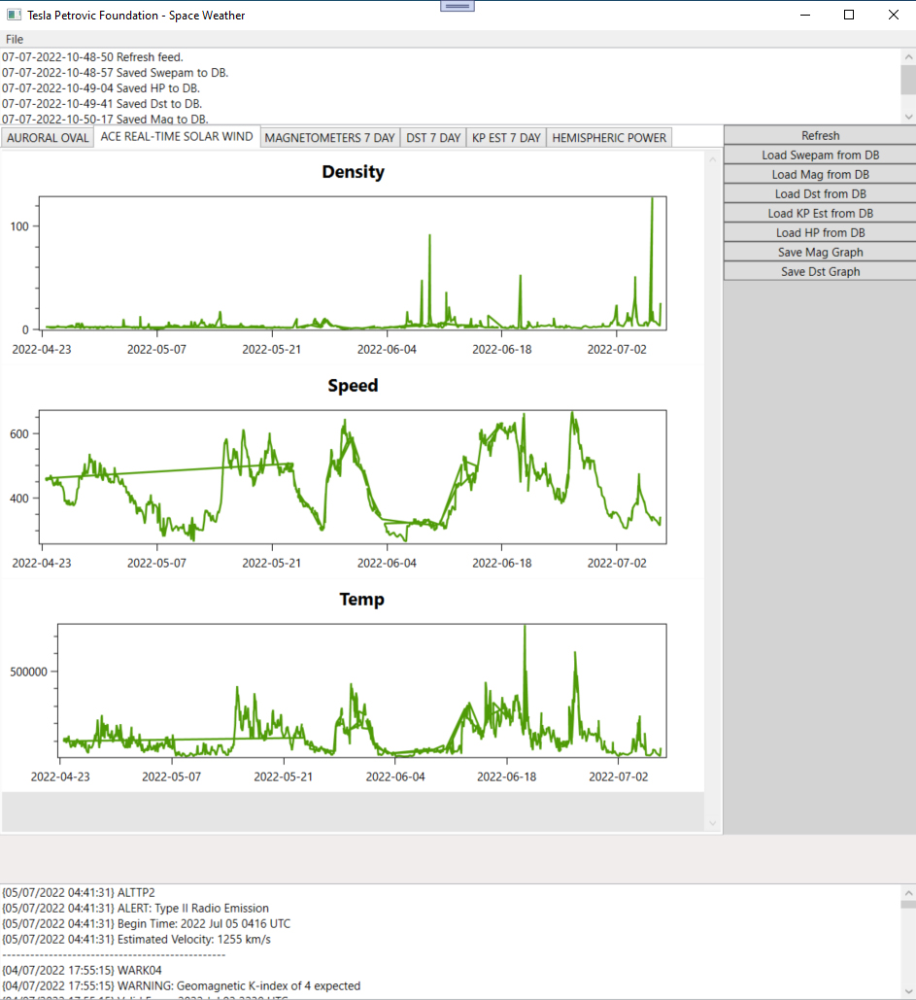
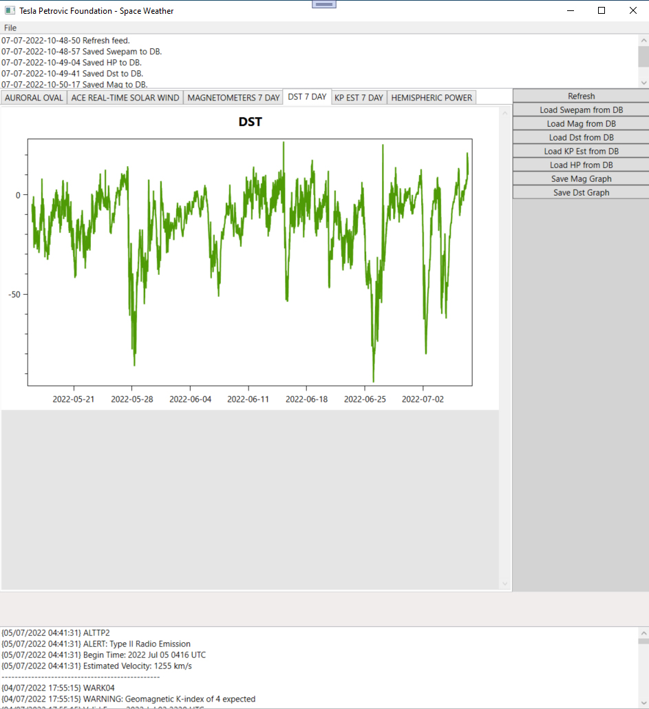
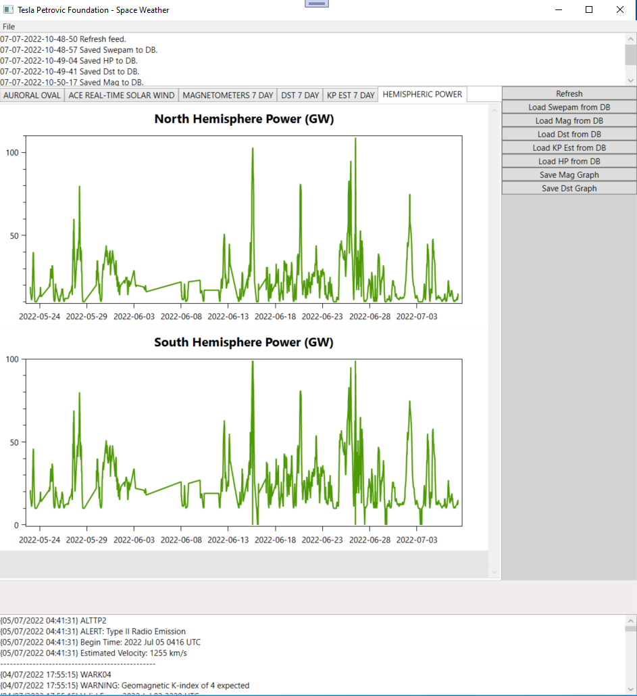
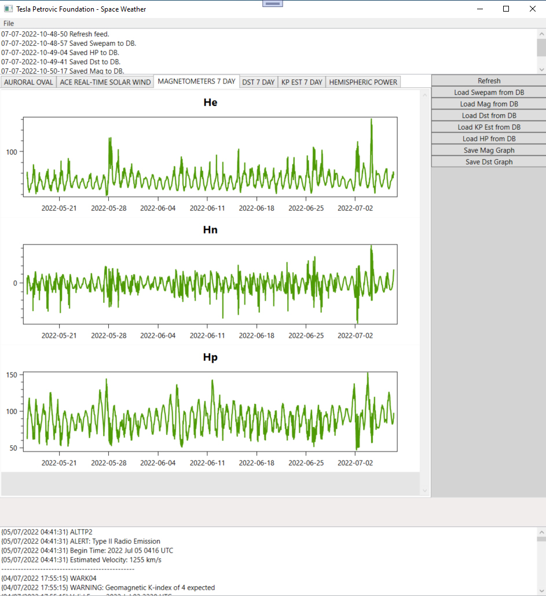
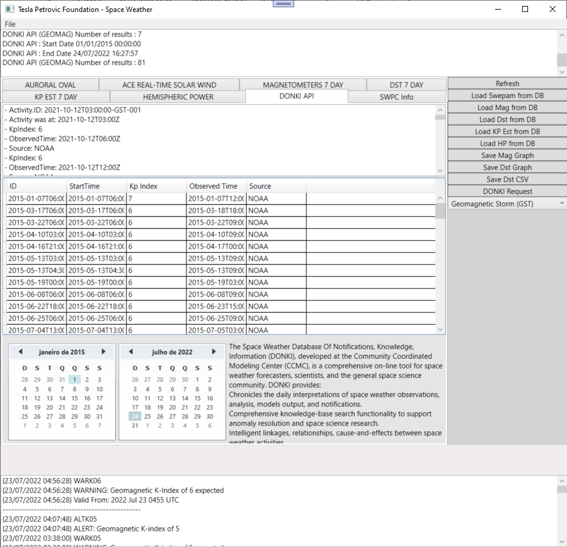
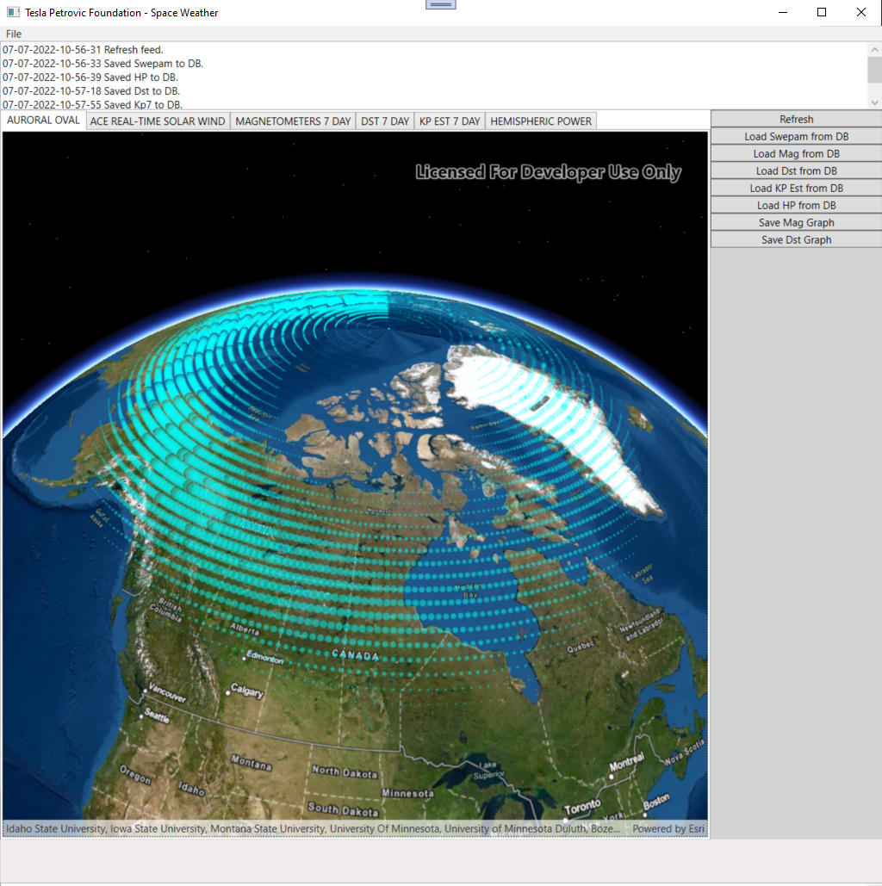
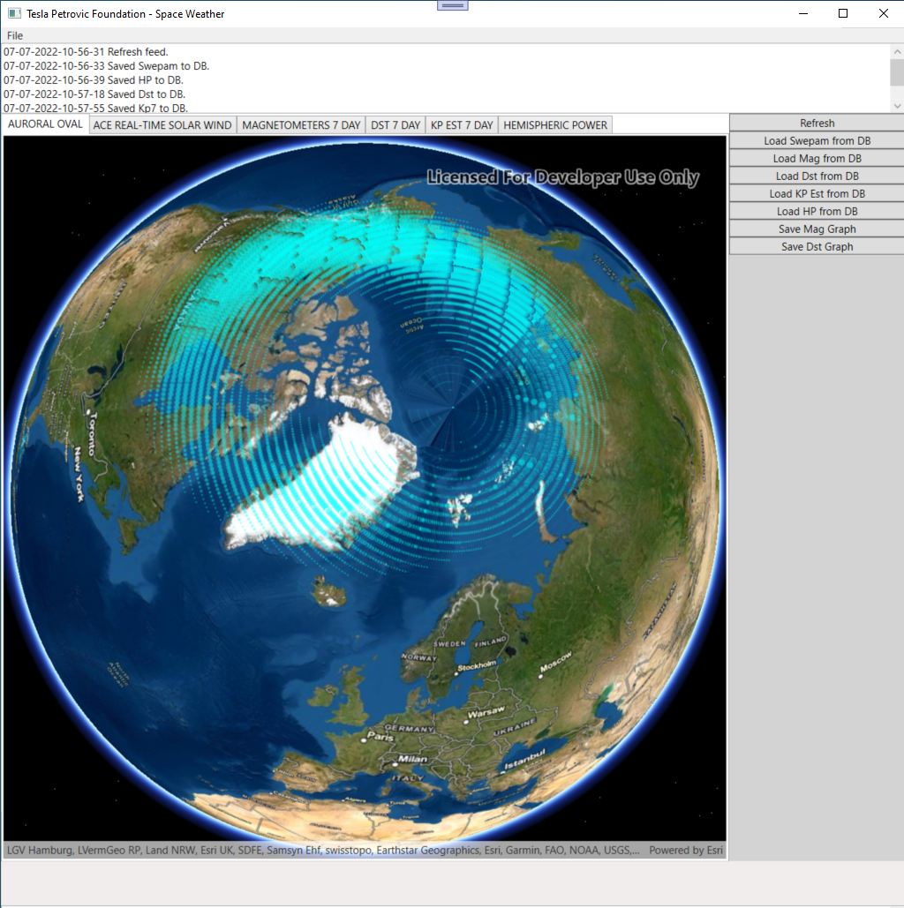
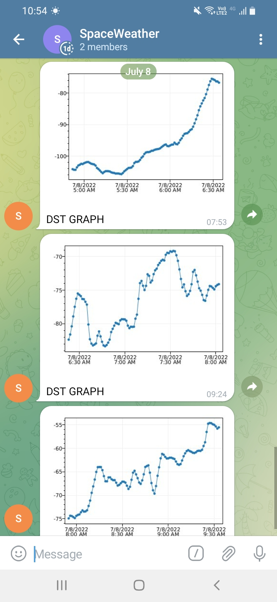
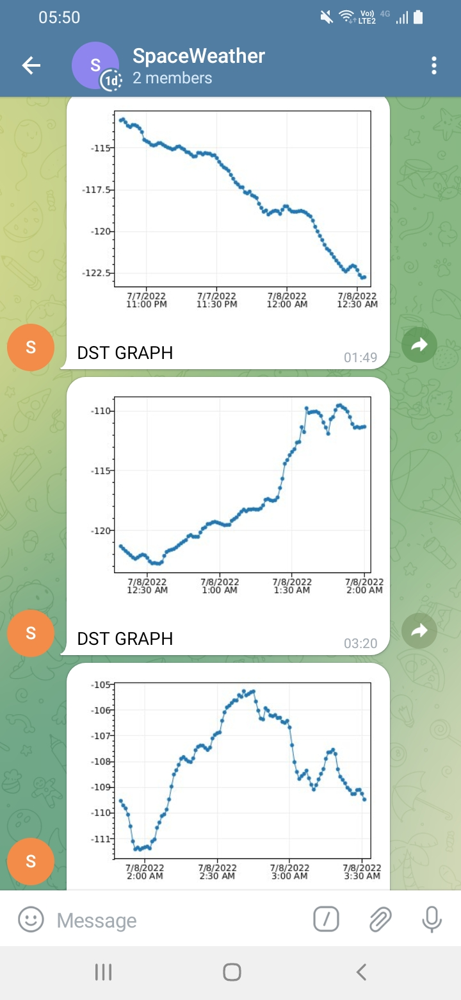
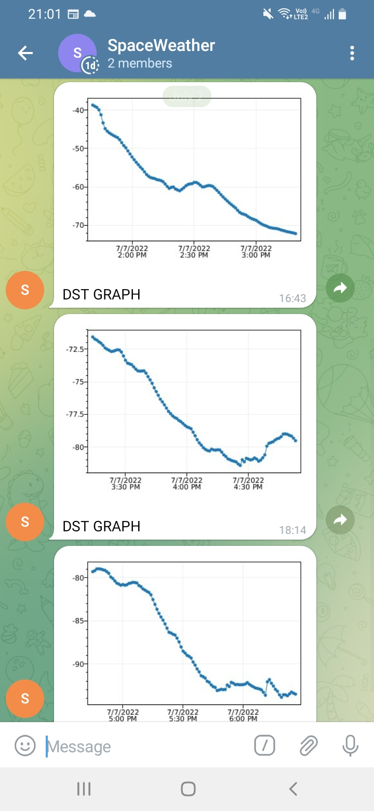

HAMSCI

NIKOLA TESLA INSTITUTE
SPACE WEATHER STATION SYSTEM
 
1) WINDOWS FORMS - DESKTOP APPLICATION
2) WINDOW WPF - DESKTOP APPLICATION
3) WINDOWS FORMS ALERT - MONO SUITED VERSION OF DESKTOP APPLICATION
4) CONSOLE PROGRAM IS INTENDED TO BE RUN ON RASPBERRY PI TERMINAL 24/7 WITH THE USE OF MONO

PREREQUISITES INSTALLATION :  
	sudo apt install mono-complete 
INSTALLATION FAQ FOR MONO : https://pimylifeup.com/raspberry-pi-mono-framework/ 
	sudo apt install postgresql 
INSTALLATION FAQ FOR POSTGRESQL : https://pimylifeup.com/raspberry-pi-postgresql/ 

TWO SIMULTANEOUS TASKS FOR RETREIVING NOAA DATA AND ALERTING USERS
1) LOOPING EVERY 60 SECONDS WITH DATA RETREIVAL
	DATA INPUT IS SWPC NOAA TEXT AND JSON PRODUCTS
	https://services.swpc.noaa.gov/products/alerts.json
	https://services.swpc.noaa.gov/json/planetary_k_index_1m.json
	ttps://services.swpc.noaa.gov/json/geospace/geospace_pred_est_kp_1_hour.json
	https://services.swpc.noaa.gov/json/geospace/geospace_dst_1_hour.json
2) LOOPING EVERY 90 MINUTES WITH GEOSPACE DATA RETREIVAL, CHECK, DATABASE STORAGE AND MULTICHANNEL ALERTING
	https://services.swpc.noaa.gov/json/goes/primary/magnetometers-7-day.json
	https://services.swpc.noaa.gov/json/ace/swepam/ace_swepam_1h.json
	https://services.swpc.noaa.gov/json/geospace/geospace_dst_7_day.json
	https://services.swpc.noaa.gov/json/geospace/geospce_pred_est_kp_7_day.json
	https://services.swpc.noaa.gov/json/ovation_aurora_latest.json
	https://services.swpc.noaa.gov/json/enlil_time_series.json
	https://services.swpc.noaa.gov/text/aurora-nowcast-hemi-power.txt
 
CREATION OF THE SPACE WEATHER DATABASE

DATA IS COLLECTED FROM THE NATIONAL OCEANIC AND ATMOSPHERIC ADMINISTRATION SPACE WEATHER PREDICTION CENTER (NOAA-SWPC)

ACE/SWEPAM (1h)

 

ESTIMATED KP INDEX (7 days)

DST INDEX (7 days)

 

HEMISPHERIC POWER

 

GOES MAGNETOMETERS (1-minute data, 7 days timespan) 
https://www.swpc.noaa.gov/products/goes-magnetometer 
Historically, the data have been presented in the E (earthward), P (parallel) and N (normal) coordinate system where:
Hp:  magnetic field vector component, points northward, perpendicular to the orbit plane which for a zero degree inclination orbit is parallel to Earth's spin axis.
He:  magnetic field vector component, perpendicular to Hp and Hn and points earthward.
Hn:  magnetic field vector component, perpendicular to Hp and He and points eastward.

 

WSA-ENLIL SOLAR WIND PREDICTION 
https://www.swpc.noaa.gov/products/wsa-enlil-solar-wind-prediction 

AURORA OVATION 
https://services.swpc.noaa.gov/json/ovation_aurora_latest.json 

HOW-TO SETUP OF ESRI ARCGIS DEVELOPER ACCOUNT TO USE WITH AURORA OVAL GIS 
https://developers.arcgis.com/net/ 

NASA DONKI API is utilized to display data table of CMEs from start to end date. 
Head over to https://api.NASA.gov to applying for an API key sent you your email 

 

The Space Weather Database Of Notifications, Knowledge, Information (DONKI), developed at the Community Coordinated Modeling Center (CCMC), is a comprehensive on-line tool for space weather forecasters, scientists, and the general space science community. 
DONKI provides: 
Chronicles the daily interpretations of space weather observations, analysis, models output, and notifications provided by the Moon to Mars Space Weather Operations Office as a courtesy to the community. 
Comprehensive knowledge-base search functionality to support anomaly resolution and space science research. 
Intelligent linkages, relationships, cause-and-effects between space weather activities. 
Comprehensive webservice API access to information stored in DONKI 
DONKI Goals: 
One-stop on-line tool for space weather researchers and forecasters. 
Gathers and organizes space weather scientists interpretations and daily activities with correlations and direct links between relevant space weather observations. 
Enables remote participation by students, world-wide partners, model and forecasting technique developers. 

 
 

POSTGRESSQL IS USED FOR RASPBERRY PI  
SQL CREATION SCRIPTS ARE PORVIDED OR 
BACKUP RESTORE OF ONE OF OUR DATABASE BACKUPS 

CREATION OF TELEGRAM GROUP AND TELEGRAM BOT FOR DST INDEX ALERT AND GRAPHIC DISPLAY 
TELEGRAM BOT API IS USED https://github.com/TelegramBots/Telegram.Bot 
TELGRAM BOT SETUP FAQ https://creativeminds.helpscoutdocs.com/article/2829-telegram-bot-use-case-how-to-create-a-bot-on-telegram-that-responds-to-group-messages 

&nbsp;&nbsp; 
